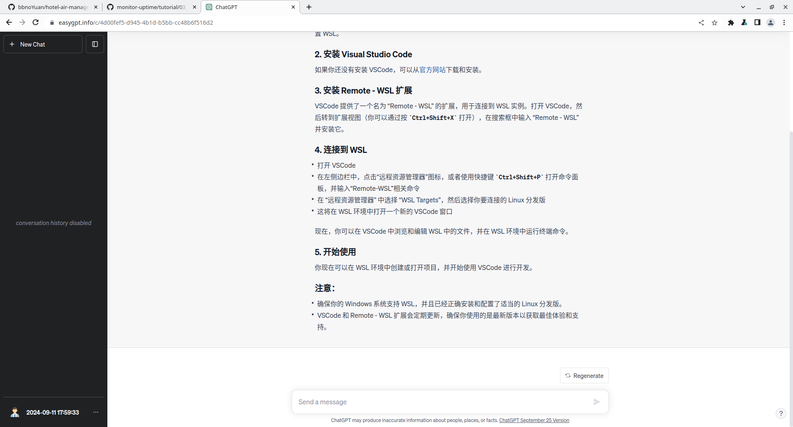
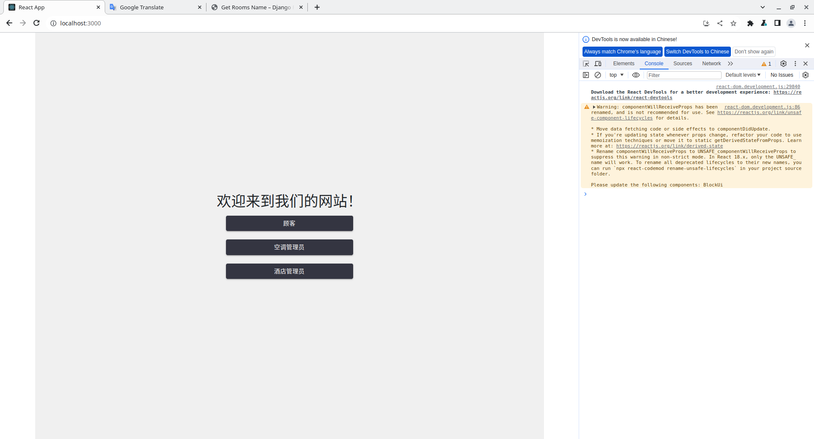
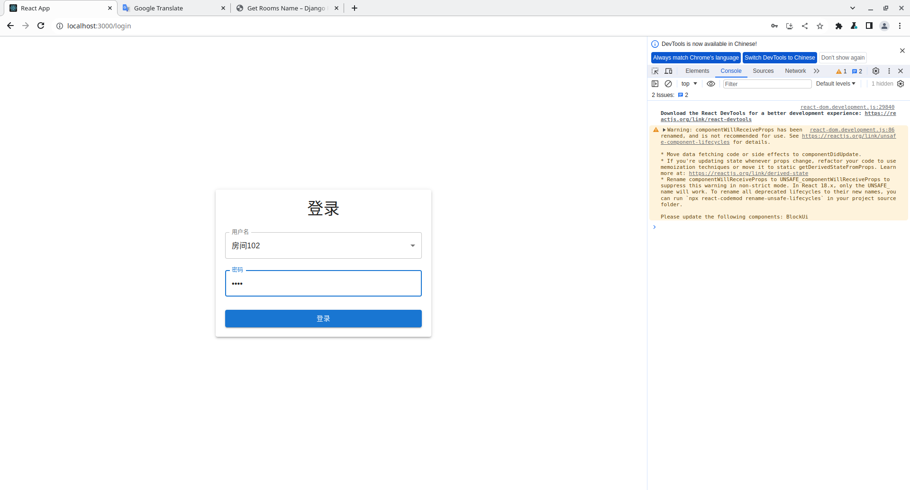
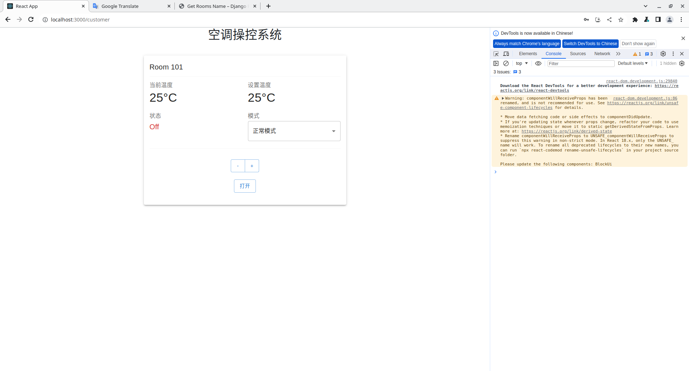
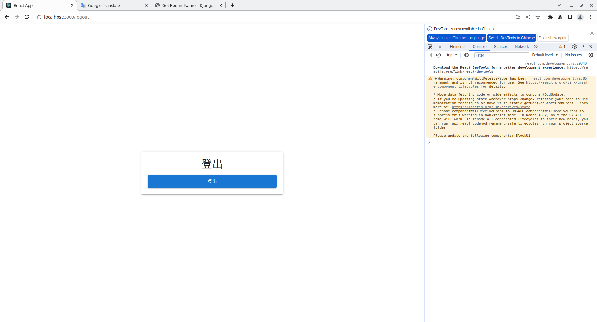
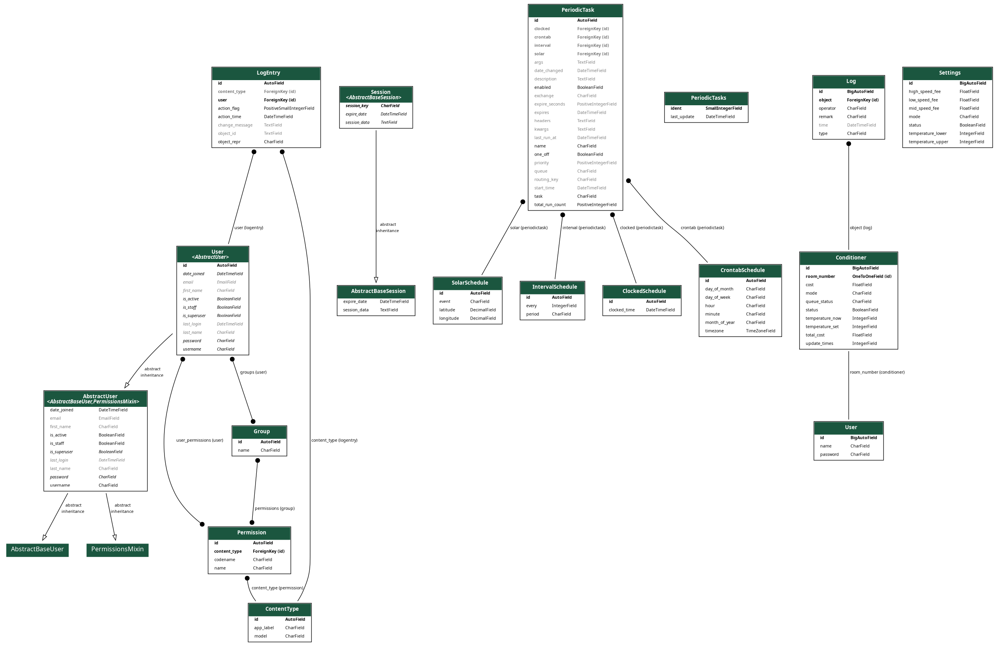

# hotel-air-manager

## 2023/9/28

尝试了一下上学期的框架，与 hammer 沟通后发现功能差别挺大的，还是老老实实从 0 开始构建吧。

## 2023/10/10

没有可以用的电脑，只能大致讲一下怎么搭环境。需要 linux 或者 windows 的 WSL，编辑器推荐 vscode。

### 环境搭建步骤:

1. 在 ubuntu 的文件夹里找一个合适的位置克隆项目：
   ```
   git clone https://github.com/bbnoYuan/hotel-air-manager.git
   ```
2. 用 vscode 打开该项目，连接 WSL（linux 不需要这一步，相当于在 windows 跑 linux 环境）。这时系统可能会提示用 WSL 打开，没有的话要下载一个插件，记不清了，看 chatgpt 吧。
   
3. 为后端创建一个虚拟环境，在终端依次输入以下命令：

#### 导航到后端对应目录

```
cd backend
```

#### 创建虚拟环境（.env 是你的虚拟环境名，我推荐使用.env）

```
python3 -m venv .env
```

#### 激活虚拟环境（不出意外地址前面会多出一个"(.env)"）

```
source venv_name/bin/activate
```

4. 为前端安装必需的包：

```
pip install -r requirements.txt
```

5. 数据库迁移：

```
cd backend
python manage.py makemigrations
python manage.py migrate
```

6. 启动后端服务器：

```
python manage.py runserver
```

7. 新建一个终端，启动前端服务器：

```
# 使用的包管理器是yarn,好像是要安装nodejs
cd frontend
sudo apt update
sudo apt install nodejs npm
npm install -g yarn
yarn install
yarn start
```

8. 默认前端跑的本地 3000 端口

```
localhost:3000
```

后端跑的本地 8000 端口

```
127.0.0.1:8000
```

数据库是默认的 db.sqlite3。<br> 9. 目前就前端画了 2 个 UI，在 localhost:3000/customer 和 localhost:3000/login，后端还没动（汗）。

10. 有问题的话直接找我吧，相关学习资料以后补上。

## 2023/10/15

添加了前端用户登录和认证,不确定数据库有没有一起上传,已经上传的话,下面是我的设置
访问127.0.0.1/admin(Django自带的管理员界面)的用户名:admin,密码:123456

```
用户名:房间101,密码:1111
用户名:房间102,密码:2222
用户名:房间103,密码:3333
用户名:房间104,密码:4444
```

通过访问127.0.0.1/admin验证;如果没有的话需要自己创建一个超级用户,具体方法如下(注意要在虚拟环境下运行,具体方法见上面的3. 激活虚拟环境):

```
python manage.py createsuperuser
```

然后输入用户名和密码,就可以在后端登录了,登录后可以在后端管理界面添加用户,用于测试前端登录功能.





## 2023/10/16

customer界面前后端数据的同步基本完成了,前端数值改变,后端数据库跟着改变</br>
下一步做后端的日志记录,前端的日志显示,以及前端的UI美化

## 2023/10/25

增加了一个温度模拟器,通过celery实现的,为了实现该功能你需要安装一些新的包,在./backend目录(虚拟环境下)运行

```
pip install -r requirements.txt
```

如果你是首次使用celery,需要启动redis服务

```
sudo pacman -Syu
sudo pacman -S redis
sudo systemctl start redis
# 如果想要开机自启动
sudo systemctl enable redis
# 查看redis状态
sudo systemctl status redis
```

确保你已经运行了 Celery Beat 的数据库迁移命令，以创建 django_celery_beat_periodictask 表

```
python manage.py migrate django_celery_beat
```

然后新建一个终端,在./backend目录(虚拟环境)下运行cellery服务器

```
celery -A backend worker -l info
```

然后再新建一个终端,在./backend目录(虚拟环境)下运行cellery beat服务器

```
celery -A backend beat -l info
```

然后登陆127.0.0.1/admin,就可以看到温度和费用在变化了</br>
前端还要加一个定时任务, 每10秒重新请求以下当前温度,然后更新到前端,免费GPT4的网站崩了,前端先不做了吧

## 2023/10/26

更改requirements.txt中的django-filter==23.3

## 2023/11/2

添加新API,初始化空调管理员页面UI.

## 2023/11/6
不要在根目录下执行prettierrc,会把所有文件都格式化,导致git提交的时候出现大量的改动,在frontend目录下执行prettierrc即可(血的教学,把我的backend模版全改了)

## 2023/11/7
前端代码稍微重构了一下,解决了管理员界面空调状态前后端同步的问题,请完成其他按钮的功能,另外需要注意的是,为了偷懒,我当前请求后端的方式其实是非常危险的,容易会对数据造成很大的改动,更不用谈安全问题了,还是考虑到协调组,认为当前做到这个程度就可以了</br></br>

当前没有注意角色登陆这一块的逻辑,后面再去弄吧,</br>

啊啊啊,魔法工坊一晚上没打过第二关,郁郁了,管理员每写完,明天写
前端代码稍微重构了一下,解决了管理员界面空调状态前后端同步的问题,请完成其他按钮的功能,另外需要注意的是,为了偷懒,我当前请求后端的方式其实是非常危险的,容易会对数据造成很大的改动,更不用谈安全问题了,还是考虑到协调组,认为当前做到这个程度就可以了

## 2023/11/8
完善管理员按钮功能.

## 2023/11/9
你怎么知道我昨天魔法工艺一命通关😋管理员功能差不多了,接下来用celery做一个队列任务,实现最多为三名用户服务,用户的数量将变为10个,然后后端做一个日志功能,前端做一个日志显示界面,就可以了.</br></br>
队列任务似乎完成了,日志功能完成了以后一起测试</br></br>
还有前台和酒店经理的前端没做</br>

## 2023/11/11
介绍一个好玩的调试工具,django-extension,可以用来生成模型图,命令如下
```
python manage.py graph_models -a -o my_project_model_diagram.png
```
生成的图片如下

上传了第三次实验的文档模板,uml图用的plantuml,可以用vscode的插件生成,具体方法见[这里](https://marketplace.visualstudio.com/items?itemName=jebbs.plantuml)

## 2023/11/12

更新UI.

## 2023/11/14
cxr的任务安排了,在README_CHEN.md,xzm的明天再说吧</br>
xzm的任务安排了,在README_XU.md,提醒大家在写代码之前一定要pull最新的分支,在主目录下
```
git pull
```

## 2023/11/18
更新了前台的详单界面

## 2023/11/19
好烦,有点过载,写一个todu
- [ ] 前台的离店结算
- [ ] 详单界面,包括下载
- [ ] 去后端修改一些详单的统计规则
- [ ] 报表相关?
- [ ] 身份认证
1. 离店结算主要是生成详单这一块,我打算用MUI的表格,里面有export的插件,直接生成csv等格式,然后下载
2. 报表差不多可以快完成了,用的mui的chart

ps:好久没有读mui的官方文档,更新了好多组件,越来越像一个现代的UI库了

## 2023/11/20
- [x] 前台的离店结算
- [x] 详单界面,包括下载
</br>ps:这个离店结算写得真有水准吧